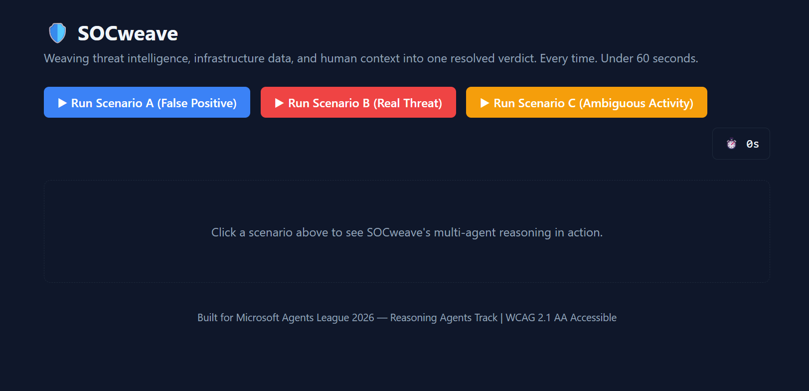
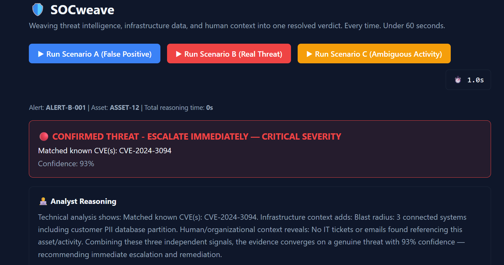

<div align="center">

# 🛡️ SOCweave

### Weaving threat intelligence, infrastructure data, and human context into one resolved verdict. Every time.

**Built for Microsoft Agents League 2026 — Reasoning Agents Track**

[](LICENSE)


</div>

---

## 🎯 The Problem

SOC analysts spend **4–6 hours daily** investigating security alerts that turn out to be false positives — a major driver of analyst burnout. Every alert looks scary in isolation because it's judged purely on technical signals, with no awareness of *why* the activity happened or *who* it could really affect.

**SOCweave fixes this** by reasoning like a senior analyst: cross-examining technical evidence, infrastructure impact, and human/organizational context — together — before reaching a verdict.

---

## 🧠 What It Does

SOCweave is a **multi-agent reasoning system** with 5 distinct agent roles working together:

| # | Agent | Role |
|---|---|---|
| 1 | **Triage Orchestrator** | Plans the investigation — produces a visible "Reasoning Trace" before execution |
| 2 | **Foundry IQ Agent** | Grounds the alert against CVEs, MITRE ATT&CK, and threat intel — every claim cited |
| 3 | **Fabric IQ Agent** | Maps the infrastructure blast radius via a semantic ontology graph |
| 4 | **Work IQ Agent** | Scans M365 emails/tickets for human authorization context |
| 5 | **Verdict Synthesizer (Critic)** | Combines all signals into a confidence-scored verdict — and **re-queries itself** if confidence falls below 70% |

A sixth component, the **Analyst Co-Pilot**, lets a human analyst ask follow-up questions about any verdict using offline semantic NLP.

---

## 🔍 How It Works — Visual Walkthrough (Scenario A)

The diagram below walks through a real example end-to-end: a CRITICAL alert
on `ASSET-07` is investigated by all five agents and correctly resolved as
authorized maintenance with 91% confidence.


---

## 🏗️ Architecture
┌─────────────────────────┐
                │  TRIAGE ORCHESTRATOR     │
                │  (Planner)               │
                └─────────┬─────────────────┘
            ┌──────────────┼──────────────┐
    ┌───────▼─────┐ ┌──────▼──────┐ ┌─────▼──────┐
    │ Foundry IQ   │ │ Fabric IQ   │ │ Work IQ    │
    │ Agent        │ │ Agent       │ │ Agent      │
    │ CVE/MITRE    │ │ Blast       │ │ Email/     │
    │ grounded RAG │ │ radius graph│ │ ticket scan│
    └───────┬─────┘ └──────┬──────┘ └─────┬──────┘
            └──────────────┼──────────────┘
                ┌─────────▼─────────────┐
                │ VERDICT SYNTHESIZER    │
                │ (Critic/Verifier +     │
                │  confidence + severity)│
                │  self-corrects if      │
                │  confidence < 70%      │
                └─────────┬─────────────┘
                ┌─────────▼─────────────┐
                │ ANALYST CO-PILOT       │
                │ (semantic Q&A over     │
                │  verdict context)      │
                └────────────────────────┘

> 💡 The Analyst Co-Pilot uses **spaCy semantic similarity** (offline NLP) to
> understand question *meaning*, not just keywords — e.g. "Should I be
> worried about this?" correctly routes to the reasoning/evidence category
> even though it shares no exact words with that category's reference text.

---

## 🎬 Scenario Suite — Three Demos, Three Reasoning Outcomes

SOCweave proves it **reasons contextually**, not just pattern-matches, with three distinct cases covering the full decision space: clear false positive, clear true threat, and genuine ambiguity.

### 🟢 Scenario A — The False Positive
A **CRITICAL** "mass file deletion" alert turns out to be authorized maintenance — confirmed by an IT helpdesk ticket and an admin email.

> **Verdict: CRITICAL → LOW** | Confidence: **91%** | Status: `AUTHORIZED MAINTENANCE`

### 🔴 Scenario B — The Real Threat
A **HIGH** "unusual outbound transfer" alert matches a known C2 server and CVE, with **zero** authorization found anywhere in the organization.

> **Verdict: HIGH → CRITICAL** | Confidence: **93%** | Status: `CONFIRMED THREAT — ESCALATE IMMEDIATELY`
> Auto-generated remediation plan included.

### 🟡 Scenario C — Ambiguous Insider Activity (Critic Loop Demo)
An employee with legitimate database access logs in 4+ hours after their normal session ended — not clearly malicious, but anomalous.

> **Verdict: MEDIUM (unchanged)** | Confidence: **65%** | Status: `MONITOR - LOW CONFIDENCE`

This is the most important demo: confidence falls **below the 70% threshold**, **triggering SOCweave's Critic agent** to simulate a re-query for extended context before finalizing. SOCweave doesn't just answer — it knows when it's *uncertain* and says so, rather than forcing a confident-sounding but unjustified verdict.

---

## 🎬 Demo Video

[▶ Watch the full demo on YouTube](https://youtu.be/jNmnG1klsSE)

---

## 📸 Screenshots

**Scenario A — Authorized Maintenance (False Positive, CRITICAL → LOW)**


**Scenario B / C — Confirmed Threat & Ambiguous Activity**


---

## 🚀 Clone & Run

### 1. Clone this repository
```bash
git clone https://github.com/Pradeep-G369/socweave.git
cd socweave
```

### 2. One-command demo (Git Bash)
```bash
bash run_demo.sh --scenario=a
bash run_demo.sh --scenario=b
bash run_demo.sh --scenario=c
```

### 3. Full interactive UI

**Terminal 1 — Backend:**
```bash
python -m venv .venv
.venv\Scripts\activate          # Windows
cd backend
pip install -r requirements.txt
uvicorn main:app --reload --port 8000
```

**Terminal 2 — Frontend:**
```bash
cd frontend
npm install
npm run dev
```

Open **`http://localhost:5173`** and click any of the three scenario buttons.

---

## 🧩 Microsoft IQ Integration

| IQ Layer | Role in SOCweave |
|---|---|
| **Foundry IQ** | Grounded retrieval of CVEs, MITRE ATT&CK techniques, and threat-intel matches — every claim is cited |
| **Fabric IQ** | Semantic ontology mapping of infrastructure blast radius, connected systems, and data ownership |
| **Work IQ** | Human context plane — scans M365 emails/tickets to distinguish authorized activity from real threats |

---

## 🏆 Feature → Judging Rubric Map

| Feature | Judging Criterion | Weight |
|---|---|---|
| Foundry IQ CVE/MITRE grounding with citations | Accuracy & Relevance | 20% |
| 5-agent reasoning chain + Critic self-correction loop (Scenario C) | Reasoning & Multi-step Thinking | 20% |
| Three-scenario suite (false positive, true threat, ambiguous) | Creativity & Originality | 15% |
| Reasoning Trace, Confidence Bar, Analyst Reasoning, Co-Pilot | UX & Presentation | 15% |
| Input sanitization, rate limiting, PII scrubbing (Presidio), evaluation harness | Reliability & Safety | 20% |
| Discord community sharing | Community Vote | 10% |

---

## ✅ Evaluation Results

SOCweave includes an automated evaluation harness that validates verdict
accuracy against expected outcomes for all three scenarios.
==================================================

SOCweave Evaluation Report
✅ PASS — Scenario A

Severity match : True

Status match   : True

Confidence     : expected 94%, actual 91% (diff: 3)
✅ PASS — Scenario B

Severity match : True

Status match   : True

Confidence     : expected 97%, actual 93% (diff: 4)
✅ PASS — Scenario C

Severity match : True

Status match   : True

Confidence     : expected 68%, actual 65% (diff: 3)
==================================================

RESULT: 3/3 scenarios passed
Run it yourself:
```bash
cd backend
python eval/run_eval.py
```

---

## 🧪 Unit Tests

Individual agent modules are unit-tested in isolation to verify
scoring logic independently of the end-to-end pipeline.
eval/test_agents.py::test_foundry_iq_detects_cve_match        PASSED

eval/test_agents.py::test_foundry_iq_no_match_low_signal       PASSED

eval/test_agents.py::test_fabric_iq_blast_radius_scoring       PASSED

eval/test_agents.py::test_work_iq_approved_ticket_raises_authorization PASSED

eval/test_agents.py::test_work_iq_no_evidence_zero_authorization PASSED
5 passed
Run it yourself:
```bash
cd backend
python -m pytest eval/test_agents.py -v
```

---

## 🔒 Data Safety & Privacy

All data used is **100% synthetic** — fabricated for demo purposes, with no
real PII, credentials, or customer data. `backend/safety/clean_data.py` uses
**Microsoft Presidio** to automatically scrub names, emails, phone numbers,
and IP addresses from human-context data before any agent processes it.

## 🛡️ Input Security

`backend/safety/sanitize.py` validates every incoming alert against a strict
schema (required fields, valid severity enum) and applies an in-memory rate
limit (10 requests/minute) before any processing begins.

> **Note:** the current rate limiter is in-memory and scoped to a single
> server instance. A production deployment would use Redis or Azure API
> Management for distributed rate limiting.

## ♿ Accessibility

SOCweave meets **WCAG 2.1 AA** standards: all interactive elements have ARIA
labels, severity is communicated via icon + text (not color alone), confidence
updates are screen-reader announced, and every component is keyboard-navigable.

## 🌍 Social Impact

By eliminating false-positive investigation fatigue, SOCweave directly
addresses analyst burnout — a documented mental-health concern across SOC
teams operating under constant high-alert volume.

---

## 🛠️ Technologies Used

- **Microsoft Foundry IQ, Fabric IQ, Work IQ** — simulated via structured
  data representing realistic agentic retrieval responses
- **Python FastAPI** — multi-agent orchestration backend
- **React + Vite + Tailwind CSS** — dark enterprise UI
- **Mermaid.js** — blast radius diagrams
- **Microsoft Presidio** — PII detection & scrubbing
- **spaCy NLP (semantic similarity)** — powers the Analyst Co-Pilot's
  question understanding, fully offline
- Developed using **GitHub Copilot** in VS Code for AI-assisted development

---

## 🔭 Future Work

- Replace mock IQ data with live Microsoft Foundry IQ, Fabric, and Graph
  API connectors — see [INTEGRATION.md](INTEGRATION.md) for the step-by-step
  guide
- Persist alert history and analyst feedback in a database for continuous
  evaluation
- Parallelize the three IQ agent calls with `asyncio.gather()` for higher
  throughput
- Deploy as a Hosted Agent in Foundry Agent Service for production scale

---

## 📄 License

This project is licensed under the [MIT License](LICENSE).
