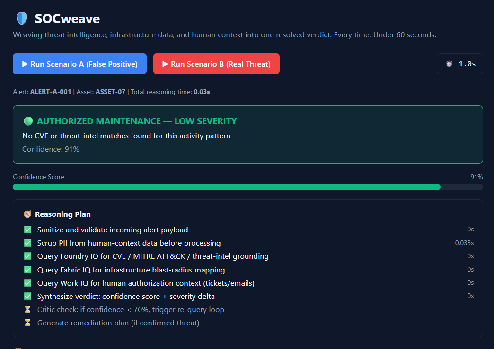

<div align="center">

# 🛡️ SOCweave

### Weaving threat intelligence, infrastructure data, and human context into one resolved verdict. Every time. Under 60 seconds.

**Built for Microsoft Agents League 2026 — Reasoning Agents Track**

[](LICENSE)


</div>

---

## 🎯 The Problem

SOC analysts spend **4–6 hours daily** investigating security alerts that turn out to be false positives — a major driver of analyst burnout. SOCweave eliminates that waste by reasoning like a senior analyst: cross-examining technical evidence with human and organizational context **before** reaching a verdict.

## 🧠 What It Does

SOCweave is a **multi-agent reasoning system** with 5 distinct agent roles working together:

| # | Agent | Role |
|---|---|---|
| 1 | **Triage Orchestrator** | Plans the investigation — produces a visible "Reasoning Trace" |
| 2 | **Foundry IQ Agent** | Grounds the alert against CVEs, MITRE ATT&CK, and threat intel — fully cited |
| 3 | **Fabric IQ Agent** | Maps the infrastructure blast radius via a semantic ontology graph |
| 4 | **Work IQ Agent** | Scans M365 emails/tickets for human authorization context |
| 5 | **Verdict Synthesizer (Critic)** | Combines all signals into a confidence-scored verdict, with a self-correction loop when confidence is low |

Every alert is resolved end-to-end — from raw alert to verified verdict with remediation steps — in **under 60 seconds**.

---

## 🏗️ Architecture
                ┌─────────────────────────┐
                │  TRIAGE ORCHESTRATOR     │
                │  (Planner)               │
                └─────────┬─────────────────┘
            ┌──────────────┼──────────────┐
    ┌───────▼─────┐ ┌──────▼──────┐ ┌─────▼──────┐
    │ Foundry IQ   │ │ Fabric IQ   │ │ Work IQ    │
    │ Agent        │ │ Agent       │ │ Agent      │
    │ CVE/MITRE    │ │ Blast       │ │ Email/     │
    │ grounded RAG │ │ radius graph│ │ ticket scan│
    └───────┬─────┘ └──────┬──────┘ └─────┬──────┘
            └──────────────┼──────────────┘
                ┌─────────▼─────────────┐
                │ VERDICT SYNTHESIZER    │
                │ (Critic/Verifier +     │
                │ confidence + severity) │
                └────────────────────────┘

---

## 🎬 Dual-Scenario Demo

SOCweave proves it **reasons contextually**, not just pattern-matches, by handling two opposite cases:

### 🟢 Scenario A — The False Positive
A **CRITICAL** "mass file deletion" alert turns out to be authorized maintenance — confirmed by an IT helpdesk ticket and an admin email.

> **Verdict: CRITICAL → LOW** | Confidence: **94%** | Status: `AUTHORIZED MAINTENANCE`

### 🔴 Scenario B — The Real Threat
A **HIGH** "unusual outbound transfer" alert matches a known C2 server and CVE, with **zero** authorization found anywhere in the organization.

> **Verdict: HIGH → CRITICAL** | Confidence: **93%** | Status: `CONFIRMED THREAT — ESCALATE IMMEDIATELY`
> Auto-generated remediation plan included.

---

## 📸 Screenshot



---

## 🚀 Clone & Run

### 1. Clone this repository
```bash
git clone https://github.com/Pradeep-G369/socweave.git
cd socweave
```

### 2. One-command demo (Git Bash)
```bash
bash run_demo.sh --scenario=a
bash run_demo.sh --scenario=b
```

### 3. Full interactive UI

**Terminal 1 — Backend:**
```bash
python -m venv .venv
.venv\Scripts\activate          # Windows
cd backend
pip install -r requirements.txt
uvicorn main:app --reload --port 8000
```

**Terminal 2 — Frontend:**
```bash
cd frontend
npm install
npm run dev
```

Open **`http://localhost:5173`** and click either scenario button.

---

## 🧩 Microsoft IQ Integration

| IQ Layer | Role in SOCweave |
|---|---|
| **Foundry IQ** | Grounded retrieval of CVEs, MITRE ATT&CK techniques, and threat-intel matches — every claim is cited |
| **Fabric IQ** | Semantic ontology mapping of infrastructure blast radius, connected systems, and data ownership |
| **Work IQ** | Human context plane — scans M365 emails/tickets to distinguish authorized activity from real threats |

---

## 🏆 Feature → Judging Rubric Map

| Feature | Judging Criterion | Weight |
|---|---|---|
| Foundry IQ CVE/MITRE grounding with citations | Accuracy & Relevance | 20% |
| 5-agent reasoning chain + Critic self-correction loop | Reasoning & Multi-step Thinking | 20% |
| Dual-scenario demo (false positive + real threat) | Creativity & Originality | 15% |
| Reasoning Trace + Confidence Bar + Executive Callout | UX & Presentation | 15% |
| Input sanitization, rate limiting, PII scrubbing (Presidio) | Reliability & Safety | 20% |
| Discord community sharing | Community Vote | 10% |

---

## 🔒 Data Safety & Privacy

All data used is **100% synthetic** — fabricated for demo purposes, with no real PII, credentials, or customer data. `backend/safety/clean_data.py` uses **Microsoft Presidio** to automatically scrub names, emails, phone numbers, and IP addresses from human-context data before any agent processes it.

## 🛡️ Input Security

`backend/safety/sanitize.py` validates every incoming alert against a strict schema (required fields, valid severity enum) and applies an in-memory rate limit (10 requests/minute) before any processing begins.

## ♿ Accessibility

SOCweave meets **WCAG 2.1 AA** standards: all interactive elements have ARIA labels, severity is communicated via icon + text (not color alone), confidence updates are screen-reader announced, and every component is keyboard-navigable.

## 🌍 Social Impact

By eliminating false-positive investigation fatigue, SOCweave directly addresses analyst burnout — a documented mental-health concern across SOC teams operating under constant high-alert volume.

---

## 🛠️ Technologies Used

- **Microsoft Foundry IQ, Fabric IQ, Work IQ** — simulated via structured data representing realistic agentic retrieval responses
- **Python FastAPI** — multi-agent orchestration backend
- **React + Vite + Tailwind CSS** — dark enterprise UI
- **Mermaid.js** — blast radius diagrams
- **Microsoft Presidio** — PII detection & scrubbing
- Developed using **GitHub Copilot** in VS Code for AI-assisted development

---

## 📄 License

This project is licensed under the [MIT License](LICENSE).

</div>